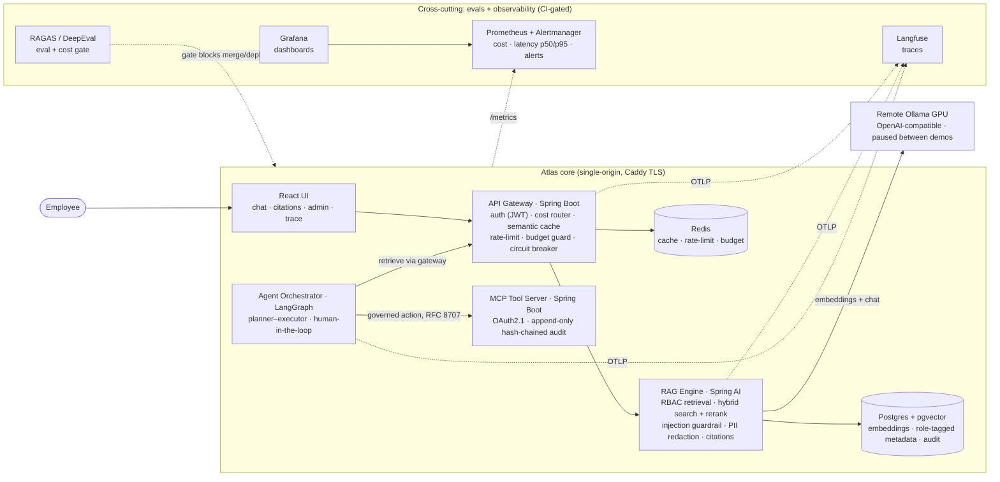

# Atlas

> Production-grade, permission-aware enterprise AI operations copilot for a financial/compliance domain.
>
> An employee asks a question → Atlas retrieves **only** documents they are cleared to see → answers **with
> citations** → and, on request, executes **governed actions** behind a human-in-the-loop checkpoint. Every
> model call is **cost-routed, evaluated, and traced**.

**Status:** **P0–P5 complete; P6 (production hardening) in progress.** A polyglot RAG + agents + MCP system
with CI-gated evals, cost-aware infra, and end-to-end observability. See [`docs/ROADMAP.md`](docs/ROADMAP.md)
for the phase plan and [`docs/PORTFOLIO.md`](docs/PORTFOLIO.md) for quantified outcomes.

**Live demo:** _`https://atlas.<your-domain>` — provisioned on demand on a free-tier Oracle Ampere A1 box
(deploy is a documented dry-run until then; see [`docs/RUNBOOK.md`](docs/RUNBOOK.md) §9.4)._ The reliable,
**GPU-free** proof is the automated 3-minute walkthrough: `cd ui && npm run e2e:demo` (see
[`docs/DEMO.md`](docs/DEMO.md)).

---

## Architecture



| Module        | Stack                   | Responsibility                                                    | Phase |
|---------------|-------------------------|------------------------------------------------------------------|-------|
| `ui/`         | React + Vite + TS       | Chat + admin; streamed answers, inline citations, agent trace    | P5    |
| `gateway/`    | Spring Boot + Spring AI | Auth, cost-aware model router, semantic cache, rate limiting     | P3    |
| `rag-engine/` | Spring AI               | Permission-aware retrieval: chunk/embed, hybrid search, citations | P1    |
| (pgvector)    | Postgres + pgvector     | Embeddings + role-tagged metadata (RBAC), agent checkpoints      | P1/P4 |
| `agents/`     | Python / LangGraph      | Planner–executor agents, memory, human-in-the-loop              | P4    |
| `mcp-tools/`  | Spring Boot (MCP)       | Governed enterprise actions exposed over MCP                     | P4    |
| `evals/`      | Python / RAGAS+DeepEval | Eval + cost harness (CI-gated) + Langfuse/Grafana observability  | P2    |
| `infra/`      | Docker / GitHub Actions | Compose stack, multi-arch images, alerts, CI/CD                  | P0/P6 |

The **LLM never runs locally** — it lives on a remote Ollama GPU endpoint set via `OLLAMA_BASE_URL`. All model
config is env-swappable; cost discipline (GPU pause/resume, small models by default, a $10/mo ceiling) is a
first-class feature — see [`docs/RUNBOOK.md`](docs/RUNBOOK.md) §11.

## Setup (from a fresh clone)

**Prereqs:** Docker + Compose v2, JDK 21 + Maven 3.9, Node 22, [`uv`](https://docs.astral.sh/uv/), and a remote
Ollama endpoint (a rented GPU — [`docs/RUNBOOK.md`](docs/RUNBOOK.md) §2). The laptop runs no model.

```bash
git clone https://github.com/venkathub/atlas-compliance-copilot.git && cd atlas-compliance-copilot
cp .env.example .env                 # set OLLAMA_BASE_URL + secrets (never commit .env)

# 1) Infra: Postgres+pgvector, Redis, Langfuse, Prometheus, Grafana, Alertmanager
make -C infra up
make -C infra health                 # asserts the stack is healthy

# 2) Verify WITHOUT a GPU (offline, deterministic): the CI gates + the UI demo
uv run --directory evals python -m atlas_evals.gate        # RAGAS + adversarial (cassette replay)
uv run --directory evals python -m atlas_evals.cost_gate   # cost-regression gate
cd ui && npm ci && npm run e2e:demo && cd ..               # the 3-min walkthrough, asserted

# 3) Full build + tests (Docker for Testcontainers ITs; no GPU)
mvn -B verify
```

**Run the live stack + demo (needs a resumed GPU):**

```bash
make -C infra gpu-up                  # resume the remote GPU (cost discipline: gpu-down when done)
set -a && . ./.env && set +a
mvn -pl rag-engine spring-boot:run &  mvn -pl gateway spring-boot:run &
docker compose -f infra/docker-compose.yml --profile app up -d mcp-tools agents
infra/deploy/seed-demo.sh             # ingest the RBAC corpus + list demo users
cd ui && npm run build && npm run preview     # http://localhost:4173 — then follow docs/DEMO.md
make -C infra gpu-down                # pause the GPU
```

Per-module setup, tests, and metrics live in each module's `README.md`.

## Technical decisions

The full, dated rationale (context · options · decision · consequences) is in
[`docs/DECISIONS.md`](docs/DECISIONS.md) (65 ADRs). The ones worth knowing:

- **Polyglot by design** — Java/Spring AI for the gateway, RAG engine, and MCP servers (the core); Python for
  LangGraph agents and RAGAS/DeepEval evals. Best tool per job, not one stack stretched. *(ADR-0001)*
- **Permission-aware retrieval** — RBAC clearance is metadata on every chunk in **pgvector**; retrieval
  filters by the caller's verified clearance *before* ranking, so cross-clearance leakage is structurally
  impossible. *(ADR-0002, 0004; negative-access hard gate)*
- **Defense-in-depth on the model I/O** — a two-layer prompt-**injection guardrail** on retrieved content
  (spotlighting + quarantine, OWASP LLM01) and **PII redaction + output sanitization** on ingress/egress
  (LLM02/LLM05). *(ADR-0015, 0037)*
- **Cost is a feature** — a declarative **cost-aware router** (small model by default; a frontier tier that
  ships **disabled**), a clearance-partitioned **semantic cache**, a Redis **token-bucket rate limiter** + a
  daily **budget guard**, and a **$10/mo ceiling** wired to a Prometheus alert. *(ADR-0035, 0036, 0038, 0040,
  0060)*
- **Honest degradation** — a **circuit breaker** fails fast (`503 + Retry-After`) when the model endpoint is
  down rather than silently substituting an expensive model. *(ADR-0039)*
- **Governed agency** — a LangGraph **planner–executor** with a durable **human-in-the-loop** checkpoint;
  writes go through **MCP** with an **RFC 8707 audience-scoped** token and land in an **append-only,
  hash-chained audit** log. *(ADR-0041, 0043, 0044, 0046, 0048)*
- **Evals gate everything** — an **offline, deterministic, GPU-free** CI gate replays committed cassettes
  (RAGAS floors + 100%-pass adversarial = hallucination guard) and a **cost-regression gate**, so a merge or
  deploy is blocked on a **quality or cost** regression. *(ADR-0030, 0064)*
- **Operable in prod** — distroless/non-root multi-stage images with health checks; **structured JSON logging
  + an `X-Request-Id`** propagated across every hop; Langfuse traces on every model call; Prometheus alerts;
  a gated, rollback-able deploy. *(ADR-0061, 0062, 0063, 0065)*

## Documentation
- [`docs/DEMO.md`](docs/DEMO.md) — the 3-minute demo click-through (+ automated `npm run e2e:demo`)
- [`docs/RUNBOOK.md`](docs/RUNBOOK.md) — operations: dev host, cloud GPU lifecycle, in-prod topology, env/secrets, cost ceiling, deploy
- [`docs/DECISIONS.md`](docs/DECISIONS.md) — architectural decision log (65 ADRs)
- [`docs/ROADMAP.md`](docs/ROADMAP.md) — vision, phase plan, risks, skills map, security baseline
- [`docs/PORTFOLIO.md`](docs/PORTFOLIO.md) — quantified, resume-ready outcomes per phase
- [`CLAUDE.md`](CLAUDE.md) — engineering operating agreement

## License
[Apache-2.0](LICENSE) © 2026 Venkatesh.
Note: the FinanceBench dataset used from P1 stays under its own **CC-BY-NC-4.0** license
(see `docs/DECISIONS.md` ADR-0004) — that covers data, not this code.
