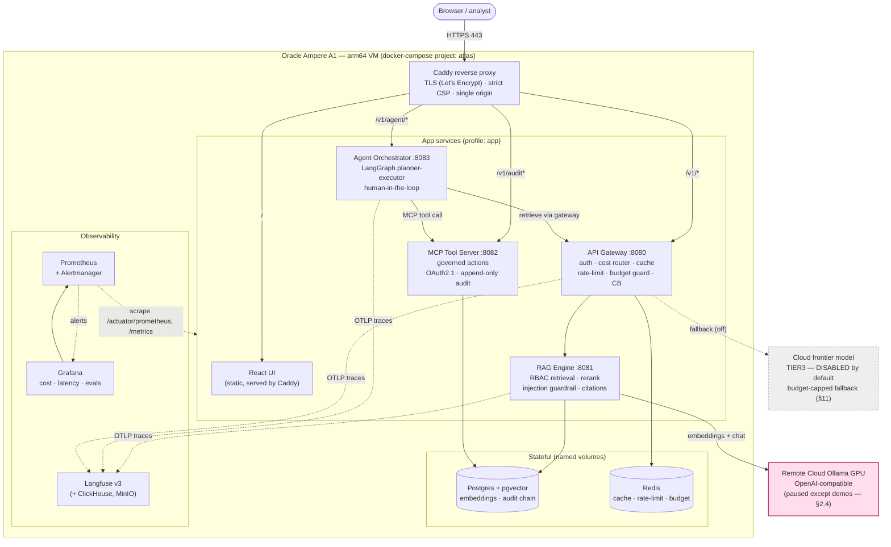

# Atlas — RUNBOOK

> Operational guide for running Atlas locally and operating its remote dependencies.
> Companion docs: `CLAUDE.md`, `docs/ROADMAP.md`, `docs/DECISIONS.md`.
> Status: **P0–P5 complete; P6 production-hardening in progress.** Covers the dev host, Cloud Ollama,
> the full service stack, evals/observability, the gateway, agents/MCP, production deploy, and (new in P6)
> the in-prod architecture diagram (§9.0), the consolidated env/secrets reference (§10), and the cost
> ceiling + cloud-frontier budget fallback (§11).

---

## 1. Local developer host

### 1.1 Required toolchain (verified versions)
| Tool | Version on host | Install source |
|---|---|---|
| Git | system | apt |
| Docker Engine | 29.x (Canonical **snap**) | snap |
| Docker Compose v2 | v5.x | bundled with Docker |
| Docker Buildx | v0.31+ | bundled with Docker |
| JDK | OpenJDK **21** | apt (`openjdk-21-jdk`) |
| Maven | **3.9.x** | apt (`maven`) |
| Python | 3.11/3.12 | system |
| uv | latest | `~/.local/bin/uv` |
| Node.js | 24 LTS (via nvm) | nvm |
| curl / jq | system | apt |

> The LLM, Postgres, Redis, Langfuse, Grafana/Prometheus do **not** run as host packages — they are
> remote (Ollama) or Docker containers.

### 1.2 One-time Docker setup (rootless access)
The snap Docker socket is owned by `root:docker`. To use Docker without `sudo`:
```bash
sudo groupadd -f docker
sudo usermod -aG docker "$USER"
sudo snap disable docker && sudo snap enable docker   # snap picks up the new group
```
**Then log out and back in** (or reboot) so your login session joins the `docker` group.
`newgrp`/`sg` are not installed on this host, so a fresh login is the clean path.

Verify after re-login:
```bash
docker run --rm hello-world          # must succeed WITHOUT sudo
docker compose version
docker buildx ls
```

### 1.3 Multi-arch builds (for ARM prod target)
Prod runs on Oracle Cloud Ampere A1 (**arm64**). One-time, to enable cross-builds from this amd64 host:
```bash
docker run --privileged --rm tonistiigi/binfmt --install all
docker buildx create --name atlas-builder --driver docker-container --use --bootstrap
docker buildx ls          # should list linux/amd64 and linux/arm64
```
**Snap-Docker note (this host):** the snap docker CLI can't read `/data` (ADR-0009), so feed the build
context via **stdin** instead of a path:
```bash
# build rag-engine for both arches (jar first: mvn -pl rag-engine -am package)
tar --exclude=./.git -C /data/aiTrack/Atlas -cf - . | \
  docker buildx build --builder atlas-builder --platform linux/amd64,linux/arm64 \
    -f rag-engine/Dockerfile -t atlas/rag-engine:dev --output type=oci,dest="$HOME/img.tar" -
```
(In GitHub Actions the runner is not confined, so the `image` job uses a normal path context — see §5.)

### 1.4 Toolchain verification (copy-paste)
```bash
git --version; docker --version; docker compose version; docker buildx version
java -version; mvn -version; python3 --version; uv --version; node --version; npm --version
curl --version | head -1; jq --version
```

---

## 2. Cloud Ollama (remote LLM endpoint)

The LLM **never runs on the laptop**. It lives on a rented Indian-cloud GPU and is reached via
`OLLAMA_BASE_URL`. Default platform: **JarvisLabs.ai** (INR/UPI, per-minute billing, pause/resume with
persistent storage). Fallback: **E2E Networks** (Indian, INR + GST).

**Sizing:** our dev model is small — an **L4 / RTX A5000 (16–24 GB VRAM)** is plenty (no H100), with
**~30–50 GB storage**. Persistent storage survives pause/resume, so pulled models stay put when paused.

**Port model (important):** in **template/instance mode** JarvisLabs publishes **port 6006** as the public
API endpoint (click the instance's **API** button for the URL). In **VM mode** you expose any port with
`--http-ports`. Pick the matching path below.

### 2.1 Provision — choose ONE path

#### Path A — Ollama template (recommended, zero-setup)
1. Launch an instance from the **Ollama framework template**: `jarvislabs.ai/templates/ollama`
   (GPU: L4 / A5000; Storage ~30–50 GB). Ollama is pre-installed and already serving.
2. Pull the dev models from the JupyterLab/SSH terminal:
   ```bash
   ollama pull qwen2.5:3b-instruct     # chat — dev default
   ollama pull nomic-embed-text        # embeddings — 768-dim
   ```
   (or via API: `curl https://<instance>.jarvislabs.net/api/pull -d '{"name":"qwen2.5:3b-instruct"}'`)
3. Click the **API** button on the instance in the dashboard and copy the public endpoint, e.g.
   `https://<instance>.jarvislabs.net` — the Ollama template maps it to Ollama. That URL is your `OLLAMA_BASE_URL`.

#### Path B — PyTorch template or VM (more control)
1. Launch a **PyTorch** template instance, **or** a **VM** (SSH-only; register a key first with `jl ssh-key add`):
   ```bash
   jl create --gpu A5000 --vm --http-ports "11434"     # VM: expose Ollama's native port
   ```
2. Install Ollama:
   ```bash
   curl -fsSL https://ollama.com/install.sh | sh
   ```
3. Serve it so it's publicly reachable — **match your mode**:
   - **Instance/template mode** → run Ollama on the public port **6006**:
     ```bash
     OLLAMA_HOST=0.0.0.0:6006 ollama serve &
     ```
     Then copy the public URL via the dashboard **API** button → that's `OLLAMA_BASE_URL`.
   - **VM mode** → run on the port you exposed (e.g. 11434):
     ```bash
     OLLAMA_HOST=0.0.0.0:11434 ollama serve &
     ```
     The custom-port URL appears under the instance's **endpoints** → that's `OLLAMA_BASE_URL`.
   - **Private alternative (any mode)** → SSH tunnel, no public exposure:
     ```bash
     ssh -L 11434:localhost:11434 -o StrictHostKeyChecking=no -p <ssh-port> root@sshd.jarvislabs.ai
     # then OLLAMA_BASE_URL=http://localhost:11434
     ```
4. Pull the dev models:
   ```bash
   ollama pull qwen2.5:3b-instruct
   ollama pull nomic-embed-text
   ```

> The two model choices fix the **pgvector embedding dimension (768)** used in P1 — see `DECISIONS.md` ADR-0005.
> Ollama serve logs live at `/home/ollama.log` (handy for debugging).

### 2.2 Wire it into Atlas
Set in your local `.env` (never commit real values; `.env.example` carries placeholders):
```bash
# template/instance mode: URL maps to port 6006 (or Ollama template's mapping); VM mode: your --http-ports URL
OLLAMA_BASE_URL=https://<your-jarvislabs-endpoint>
OLLAMA_CHAT_MODEL=qwen2.5:3b-instruct
OLLAMA_EMBED_MODEL=nomic-embed-text
OLLAMA_EMBED_DIM=768
```
All model config is env-swappable — never hardcode a model or URL.

### 2.3 Connectivity smoke test (this is the P0 exit gate, run manually anytime)
```bash
# 1) list models served
curl -s "$OLLAMA_BASE_URL/api/tags" | jq '.models[].name'

# 2) OpenAI-compatible chat completion
curl -s "$OLLAMA_BASE_URL/v1/chat/completions" \
  -H "Content-Type: application/json" \
  -d "{\"model\":\"$OLLAMA_CHAT_MODEL\",\"messages\":[{\"role\":\"user\",\"content\":\"ping\"}]}" \
  | jq '.choices[0].message.content'

# 3) embedding (assert vector length == OLLAMA_EMBED_DIM)
curl -s "$OLLAMA_BASE_URL/api/embeddings" \
  -H "Content-Type: application/json" \
  -d "{\"model\":\"$OLLAMA_EMBED_MODEL\",\"prompt\":\"hello\"}" \
  | jq '.embedding | length'
```
All three returning sane values = endpoint is healthy and ready for the RAG engine.

### 2.4 Cost discipline — pause/resume
- **Pause the instance** at the end of each dev/demo session → per-minute GPU billing stops; models persist on
  the instance's persistent storage.
- **Resume** before a session; the public endpoint may change on resume → update `OLLAMA_BASE_URL`.
- **Automated (P2, ADR D-P2-9, preferred):** `make -C infra gpu-up` / `gpu-down` (or the calibration job)
  drives resume/pause via the provider API with a **guaranteed pause** (`finally`/trap) + idle-timeout
  watchdog, and auto-discovers the fresh `OLLAMA_BASE_URL`. Manual pause/resume below is the fallback.
- Reserve the larger/frontier model only for final demos (P5); default to the small model in dev.
- Rough outlook: a disciplined pause/resume cadence keeps GPU spend to a few hundred ₹/month.

### 2.5 Security notes
- Ollama has **no auth** by default; the exposed JarvisLabs URL is obscure but not secret. Acceptable for dev.
- Do not put real data through the endpoint until it is fronted by the gateway.
- Hardening option (P3): front the endpoint with an API-key check at the gateway; log decision in `DECISIONS.md`.

---

## 3. Local service stack (Postgres+pgvector, Redis) — P0
Defined in `infra/docker-compose.yml` (stock images, **digest-pinned**, healthchecked, **named volumes**).
Snap-Docker-safe operation (ADR-0009): the Makefile pipes compose via stdin and applies init via `exec` —
no `/data` path is ever handed to a snap docker binary.
```bash
make -C infra up        # start; wait healthy; load pgvector + pg_trgm
make -C infra health    # container health + pgvector version + redis PONG
make -C infra down      # stop (keep data volumes)
make -C infra clean     # stop + delete volumes
make -C infra psql      # psql shell into atlas-postgres
make -C infra logs|ps   # follow logs / status
```
Defaults (from repo-root `.env`): Postgres `localhost:5432` (db/user `atlas`), Redis `localhost:6379`.
Verified: pgvector **0.8.2** + pg_trgm on `pg16`; both containers healthy.

## 4. Build, test & run — P0/P1
**Java (`rag-engine`):**
```bash
mvn -B verify                       # build + unit tests (surefire) + Testcontainers ITs (failsafe)
mvn -pl rag-engine test             # unit tests only (no Docker, no GPU)
mvn -pl rag-engine spring-boot:run  # boot the app (needs Postgres up — runs Flyway on start)
curl -s localhost:8081/probe/connectivity | jq   # 30s demo: chat reply + embeddingDim=768, ok=true
curl -s localhost:8081/actuator/health | jq      # liveness (does NOT call the GPU)
```
> **`verify` needs Docker** (not a GPU): from P1 the Failsafe ITs use Testcontainers to spin up
> `pgvector/pgvector:pg16` (e.g. `SchemaMigrationIT` runs the Flyway migration and asserts the schema).

**Testcontainers ↔ modern Docker daemon (api.version):** Docker daemons ≥28 (e.g. local dev on
29.x) drop support for the legacy Docker API version that Testcontainers' bundled docker-java
negotiates by default, so ITs fail with *"client version 1.32 is too old; minimum supported API
version is 1.40."* docker-java ignores the `DOCKER_API_VERSION` env var, so the build pins its
`api.version` config property via the parent-pom property **`docker.api.version`** (default `1.43`
= Docker 24/2023) and forwards it to the Failsafe-forked JVM. Override if your daemon's *max* API
is older:
```bash
mvn -B verify -Ddocker.api.version=1.41
```

**Live Ollama smoke test (P0 exit gate — needs a *resumed* JarvisLabs instance):**
```bash
set -a && . ./.env && set +a && mvn -P live -pl rag-engine verify
```
> If it returns an nginx `404`, the JarvisLabs instance is **paused** — resume it (§2.4) and re-check
> `OLLAMA_BASE_URL` (a resumed instance may publish a new URL).

**Python (`evals` scaffold):**
```bash
uvx ruff check evals
uvx --with pytest pytest evals -q
```

**Corpus (P1):** the two-layer corpus lives in `rag-engine/src/main/resources/corpus/`(`layer1/` = committed FinanceBench evidence snippets + `manifest.json`; `layer2/` = authored
AML/compliance overlay). Test fixtures (D3 shim, D4 negative-access, D7 poisoned docs) are under
`rag-engine/src/test/resources/fixtures/`. To refresh/extend Layer-1 from Hugging Face (no auth):
```bash
python rag-engine/src/main/resources/corpus/scripts/fetch_layer1.py --check   # verify entries resolve
python rag-engine/src/main/resources/corpus/scripts/fetch_layer1.py --write   # rewrite snippet files
```
See `rag-engine/src/main/resources/corpus/README.md` for provenance + license (CC-BY-NC-4.0).

**Ingest + query (P1, needs `make -C infra up` + a live Ollama; app runs with `SPRING_PROFILES_ACTIVE=local`):**
```bash
set -a && . ./.env && set +a && mvn -pl rag-engine spring-boot:run      # boots + runs Flyway
curl -sX POST localhost:8081/v1/admin/ingest -H 'X-Atlas-User: bsa-admin' | jq     # full rebuild (admin only)
curl -sX POST localhost:8081/v1/query -H 'X-Atlas-User: priya' -H 'Content-Type: application/json' \
  -d '{"query":"Summarize the open AML exceptions for the Northwind account this quarter."}' | jq
```
Clearance is supplied by the **P1-only** dev shim (ADR-0016): header `X-Atlas-User` (mapped via
`dev/clearance-users.json`) or `X-Atlas-Clearance` directly. The same Northwind query as
`X-Atlas-User: guest-public` returns no compliance/restricted citations (RBAC). Live ITs (incl.
`QueryLiveIT`) need infra up + a resumed GPU: `mvn -P live -pl rag-engine verify`.

## 5. CI & supply-chain — P0
GitHub Actions (`.github/workflows/ci.yml`) on push/PR to `main`. Five jobs (= the required status checks):

| Job (display name) | What it does |
|---|---|
| **Java build & test** | `mvn -B verify` (unit tests + Testcontainers ITs on the runner's Docker; live IT excluded) |
| **Python lint & test** | `ruff` + `pytest` on `evals` |
| **Secret scan (gitleaks)** | full-history secret scan |
| **Vuln scan & SBOM** | Trivy fs scan (vuln+misconfig+secret, **report-only for now**) + Syft CycloneDX SBOM artifact |
| **Multi-arch image build** | buildx amd64+arm64; pushes `ghcr.io/<repo>/rag-engine` on `main` only |

**Branch protection (one-time, repo owner):** Settings → Branches → protect `main` → require a PR + require
the five checks above + block force-pushes. Checks appear in the picker only after one green run.
**TODO:** flip Trivy to blocking (`exit-code 1`) once the CVE baseline is triaged; consider SHA-pinning actions.

## 6. Eval & observability harness — P2
The P2 harness lives in `/evals` (Python/RAGAS) + Langfuse/Grafana/Prometheus in `infra/docker-compose.yml`.
**Key principle (ADR D-P2-1): the CI merge gate replays committed cassettes — it needs NO GPU and NO live
Ollama.** A live GPU is only needed when you *record* cassettes or run the *live calibration* job.

### 6.1 Bring up the observability stack
```bash
make -C infra up                 # data stores + langfuse, grafana, prometheus (staged, Snap-safe)
make -C infra health             # postgres/redis/clickhouse health + langfuse/grafana/prometheus reachability
open http://localhost:3000       # Langfuse (traces + eval datasets)
open http://localhost:3001       # Grafana (eval-score / latency / trace-volume panels)
open http://localhost:9090       # Prometheus (Status → Targets shows the rag-engine scrape)
open http://localhost:9093       # Alertmanager (P6) — fired cost / error-rate / breaker / eval alerts
```
**Alerting (P6 Task 4, ADR-0063).** Prometheus loads `infra/prometheus/alerts.rules.yml` (seeded by
`make seed-config`) and routes to Alertmanager: **AtlasCostBudgetBurnHigh** (the $10/mo tripwire — 24h
cost-units >80% of the daily cap, §11), **AtlasGatewayHighErrorRate** (5xx >5%), **AtlasModelCircuitBreakerOpen**,
**AtlasServiceDown**, **AtlasEvalGateFailing**. No pager is wired by default (no-op receiver); add a
Slack/email integration in `infra/prometheus/alertmanager.yml` for prod. See fired alerts at Prometheus
`/alerts` or the Alertmanager UI (:9093).
Langfuse is **headless-bootstrapped**: `make up` auto-creates the `atlas`/`atlas-rag`
org+project and wires the API keys straight from `.env` (`LANGFUSE_PUBLIC_KEY` /
`LANGFUSE_SECRET_KEY`) — no manual "create a project" step. Log into the UI with
`LANGFUSE_INIT_USER_EMAIL` / `LANGFUSE_INIT_USER_PASSWORD` only if you want to browse traces.
Footprint note: Langfuse v3 **reuses** `atlas-postgres` (db `langfuse`) + `atlas-redis`,
adding only ClickHouse + MinIO (owner-confirmed, D-P2-5).

`rag-engine` exports OTel `gen_ai.*` spans to `OTEL_EXPORTER_OTLP_ENDPOINT`; one `/v1/query` → one trace.
Prometheus scrapes `rag-engine` at `host.docker.internal:${RAG_ENGINE_PORT}/actuator/prometheus`
(the engine runs on the host, not in the Compose network); its target shows **down** until
the engine is running — that is expected.

**Enabling trace export to Langfuse (opt-in, ADR-0030).** Export is OFF by default so tests/CI never
reach Langfuse. To stream traces in dev, set in `.env`:
```bash
OTEL_TRACES_EXPORT_ENABLED=true
OTEL_EXPORTER_OTLP_TRACES_ENDPOINT=http://localhost:3000/api/public/otel/v1/traces
LANGFUSE_OTEL_AUTH_HEADER=$(printf 'Basic %s' "$(printf '%s:%s' "$LANGFUSE_PUBLIC_KEY" "$LANGFUSE_SECRET_KEY" | base64 -w0)")
```
Trace **content** stays metadata-only unless `ATLAS_TRACE_CONTENT=full` (local dev only — redaction-gated).

### 6.2 Pull the judge model (one-time, on the resumed GPU)
The routine LLM-as-judge is `llama3.1:8b` — a **cross-family** judge (llama judging the qwen RAG
subject) to reduce self-bias — served on the **same** Cloud Ollama endpoint as the RAG model (co-resident
footprint ≈ 8 GB VRAM — fits the L4/A5000, no upgrade needed). (The published Ollama tag is `llama3.1:8b`,
which *is* the instruct model; `llama3.1:8b-instruct` is not a real tag.)
```bash
make -C infra gpu-up                          # auto-resume + health-poll + export OLLAMA_BASE_URL (ADR D-P2-9)
ssh/console into the Ollama instance, then:  ollama pull llama3.1:8b
```

### 6.3 Run the eval gate locally
```bash
# (a) OFFLINE — the CI gate. Replays committed cassettes; NO GPU, NO Ollama needed:
uv run --directory evals python -m atlas_evals.gate   # → metrics report + green/red verdict (exit code)

# (b) LIVE record/calibrate — needs infra up + a RESUMED GPU with both models pulled.
#     gpu-up resumes + discovers OLLAMA_BASE_URL; gpu-down GUARANTEES the pause afterwards:
make -C infra gpu-up
set -a && . ./.env && set +a
mvn -pl rag-engine spring-boot:run &        # boot rag-engine; ingest the corpus (admin)
curl -sX POST localhost:8081/v1/admin/ingest -H 'X-Atlas-User: bsa-admin' | jq
uv run --directory evals --group ragas python -m atlas_evals.record   # cassettes vs live RAG + judge
uv run --directory evals --group ragas python -m atlas_evals.gate --recalibrate  # rewrite baseline.json
make -C infra gpu-down                       # pause the GPU (also auto-paused on idle-timeout)
```
> Cassette key = hash(prompt + model + inputs); a **miss fails loudly** (never a silent live call). Refresh
> cassettes whenever the prompt, model tag, corpus, or golden set changes — then pause the GPU again (§2.4).

### 6.4 Live calibration job (manual, not the PR gate)
A **manual** `workflow_dispatch` workflow (`.github/workflows/calibration.yml` → *Eval calibration
(live)*) calls the GPU helper end-to-end: **resume → pull judge → boot rag-engine + ingest → record
cassettes → `--recalibrate` → Promptfoo OWASP sweep → guaranteed pause** against the live endpoint,
then commits the refreshed cassettes + `baseline.json`. It is **manual-only** (owner-confirmed cost
discipline — no nightly cron). Requires repo secrets `GPU_API_KEY` + `GPU_INSTANCE_ID`.

The per-PR **merge gate** (`ci.yml` → *Eval gate*) is the opposite: `python -m atlas_evals.gate`
**replays the committed cassettes offline** — no GPU, no Ollama, RAGAS not even installed — and blocks
merge on a RAGAS-floor / no-regression / adversarial-pass-rate breach.

The **Promptfoo OWASP sweep** (`evals/promptfoo/promptfooconfig.yaml`) targets `/v1/query` at `public`
clearance with OWASP LLM plugins (injection, PII, RBAC/BOLA, prompt-extraction, jailbreak); it runs only
in the calibration lane (GPU up), report-only — findings are distilled into the committed fixtures.

### 6.5 30-second demo (no GPU)
```bash
uv run --directory evals python -m atlas_evals.gate   # → ✅ GATE: PASS over 22 golden + 10 adversarial
cat evals/report/summary.md                            # metric table + adversarial pass-rate
make -C infra up                                       # if not already up
open http://localhost:3001                              # Grafana → "Atlas — Eval & Observability (P2)"
open http://localhost:3000                              # Langfuse → a /v1/query trace's gen_ai.* span tree
```
The gate replays committed cassettes — offline, deterministic, GPU-free.

## 7. API Gateway — P3

The Gateway (`/gateway`, Spring Cloud Gateway WebMVC) is the single front door in front of `rag-engine`
(ADR-0033). Like `rag-engine` it runs **on the host** in dev and is scraped by Prometheus via
`host.docker.internal:${GATEWAY_PORT}`.

### 7.1 Bring up the gateway-fronted stack
```bash
make -C infra up                                   # Postgres+pgvector, Redis Stack, Langfuse, Prometheus, Grafana
set -a && . ./.env && set +a
mvn -pl rag-engine spring-boot:run &               # downstream RAG engine (corpus ingested)
mvn -pl gateway spring-boot:run &                  # the front door on :${GATEWAY_PORT:-8080}
```

### 7.2 30-second demo (mint a token → ask → watch cost · GPU on)
```bash
GW=http://localhost:${GATEWAY_PORT:-8080}
# 1) Mint a signed clearance JWT for Priya (compliance) from the simulated IdP (ADR-0034)
TOKEN=$(curl -fsS -X POST "$GW/v1/auth/token" -H 'Content-Type: application/json' \
          -d '{"user":"priya"}' | jq -r .token)
# 2) Ask the Northwind question — cited, redacted, sanitized answer + routing/cache/cost fields
curl -fsS -X POST "$GW/v1/query" -H "Authorization: Bearer $TOKEN" -H 'Content-Type: application/json' \
     -d '{"query":"Summarize the open AML exceptions for Northwind this quarter.","topK":6}' | jq
# 3) Repeat the same query → semantic-cache HIT at ~zero cost (cache.hit=true)
# 4) Ask the same as a public guest → no cross-clearance cache hit, RBAC-correct answer
GUEST=$(curl -fsS -X POST "$GW/v1/auth/token" -H 'Content-Type: application/json' \
          -d '{"user":"guest-public"}' | jq -r .token)
curl -fsS -X POST "$GW/v1/query" -H "Authorization: Bearer $GUEST" -H 'Content-Type: application/json' \
     -d '{"query":"Summarize the open AML exceptions for Northwind this quarter.","topK":6}' | jq
```
A missing/expired/forged token → `401`; over-rate → `429`; over daily budget → `402`; oversized input → `413`;
a downstream failure → `503 + Retry-After`.

### 7.3 Cost dashboard
Grafana → **Atlas — Cost-aware Gateway (P3)** (`http://localhost:${GRAFANA_PORT:-3001}`, uid `atlas-cost-p3`):
cost-units/tokens/latency per route/tier/user, cache hit-rate, rate-limit/budget rejections, redaction counts,
circuit-breaker state, and a cost-spike threshold panel.

### 7.4 Eval-through-Gateway + cost-delta calibration (after any rag-engine change)
P3 changed rag-engine behaviour source (model tiering, output cap, token-usage), so the RAGAS cassettes must
be **re-recorded live** once (the fingerprint busts on purpose). Then run the gate through the gateway and the
cost-delta:
```bash
make -C infra gpu-up && set -a && . ./.env && set +a
mvn -pl rag-engine spring-boot:run & mvn -pl gateway spring-boot:run &
uv run --directory evals --group ragas python -m atlas_evals.record            # re-record RAG+judge cassettes
uv run --directory evals python -m atlas_evals.gate --recalibrate               # refresh baseline.json
ATLAS_EVAL_THROUGH_GATEWAY=true GATEWAY_URL=http://localhost:8080 \
  uv run --directory evals python -m atlas_evals.gate                           # quality holds through the gateway
GATEWAY_URL=http://localhost:8080 uv run --directory evals python -m atlas_evals.cost_report   # writes gateway-baseline.json
make -C infra gpu-down
```
Offline (no GPU), the eval-through-gateway gate **replays committed cassettes** and the safety hard gates
(`RedisSemanticCacheIT`, `PiiEgressGateTest`, `RbacNegativeAccessIT`, `PromptInjectionIT`) all pass via
`mvn verify`.

## 8. Agent Orchestrator + MCP Tools — P4

The P4 agent turns answers into **governed actions**: it retrieves through the Gateway, deterministically
decides whether an AML exception breaches the reporting threshold, **pauses for human approval**, and only
then opens a draft SAR via the MCP tool server — every action audited (append-only, hash-chained) and the
agent run evaluated as a CI merge gate. **The P4 agent is deterministic — no LLM call — so this whole flow
is GPU-free.**

### 8.1 Bring up the P4 stack
```bash
# Postgres (P0) + the two new P4 services (Spring Boot mcp-tools + Python/LangGraph agents).
set -a && . ./.env && set +a
docker compose -f infra/docker-compose.yml --profile app up -d postgres mcp-tools agents
# health
curl -fsS localhost:${MCP_TOOLS_PORT:-8082}/actuator/health
curl -fsS localhost:${AGENT_PORT:-8083}/healthz
```
The MCP server and agent share the Gateway's signing key + issuer so the resource-scoped (RFC 8707) token
verifies across the hop: keep `ATLAS_IDP_SIGNING_KEY == ATLAS_MCP_TOKEN_SIGNING_KEY` and
`ATLAS_IDP_ISSUER == ATLAS_MCP_TOKEN_ISSUER` (defaults already align in `.env.example`).

### 8.2 30-second demo (forcing story · GPU-free)
```bash
GW=http://localhost:${GATEWAY_PORT:-8080};  AG=http://localhost:${AGENT_PORT:-8083}

# 1) Mint a compliance clearance token for Priya (the agent forwards it to the Gateway for retrieval).
TOKEN=$(curl -fsS -X POST "$GW/v1/auth/token" -H 'Content-Type: application/json' \
          -d '{"user":"priya"}' | jq -r .token)

# 2) Start the run → cited summary + breach + status AWAITING_APPROVAL + a dry-run proposedAction.
RUN=$(curl -fsS -X POST "$AG/v1/agent/runs" -H "Authorization: Bearer $TOKEN" \
        -H 'Content-Type: application/json' \
        -d '{"query":"Summarize open AML exceptions for Northwind this quarter, and if any breach the reporting threshold, open a draft SAR for my review.","account":"Northwind","period":"2026-Q2"}')
echo "$RUN" | jq '{runId, status, proposedAction}'
RUN_ID=$(echo "$RUN" | jq -r .runId)

# 3) Approve → the agent mints an aud-scoped token, calls open_draft_sar over MCP, returns the draftRef.
curl -fsS -X POST "$AG/v1/agent/runs/$RUN_ID/resume" -H 'Content-Type: application/json' \
     -d '{"approved":true,"note":"Reviewed; proceed"}' | jq '{status, action}'

# (Refusal path) A sub-compliance caller never sees the breach (P1 RBAC) → no breach → no action;
# and even a forced write is DENIED at the MCP resource server (per-call clearance re-check, LLM06).
```

### 8.3 Query the append-only audit log (compliance review)
```bash
# Every tool invocation writes an immutable, hash-chained row (ATTEMPT → APPROVED/SUCCESS/DENIED/…).
docker compose -f infra/docker-compose.yml exec postgres \
  psql -U "${POSTGRES_USER:-atlas}" -d "${POSTGRES_DB:-atlas}" -c \
  "SELECT seq, ts, run_id, phase, caller, clearance, result_ref FROM agent.tool_audit ORDER BY seq;"
```
`UPDATE`/`DELETE` are rejected (least-privilege grant + an owner-proof trigger); tamper-evidence is proven
by `AuditChainVerifier` in `mcp-tools` (`AuditServiceIT` — disabling the guard + mutating a row is detected).
The draft itself: `SELECT draft_ref, account, period, status FROM agent.sar_draft;`.

### 8.4 Tests & the agent eval gate (offline, GPU-free)
```bash
mvn -pl mcp-tools verify                                   # 12 unit + 21 IT (OAuth/RBAC/audit/tool)
uv run --directory agents --group dev pytest -q            # 60 tests (+3 live-gated, skipped offline)
uv run --directory agents python -m app.eval.agent_gate    # AGENT GATE: PASS (12/12 scenarios)
```

### 8.5 Live agent-path invariant gate (needs the running stack + GPU)
The offline suite proves the agent *uses* the governed path (forwards only the caller Bearer, no clearance
header). The literal §4.3 end-to-end gate — 0 cross-clearance citations / 0 PII / injection-quarantined
*through the agent* — runs against a live Gateway+rag-engine (like the other live lanes):
```bash
make -C infra gpu-up && set -a && . ./.env && set +a
mvn -pl rag-engine spring-boot:run &   mvn -pl gateway spring-boot:run &
ATLAS_LIVE_AGENT_PATH=1 GATEWAY_URL=http://localhost:8080 \
  uv run --directory agents --group dev pytest -q tests/test_agent_path_invariants.py
make -C infra gpu-down
```

## 9. Production deploy — P5

P5 ships the clickable product behind a **single-origin Caddy reverse proxy** (serves the
built React UI + path-routes `/v1/*` to the frozen backends + terminates TLS). The P5 gate
is **deploy automation + a local internal-TLS proof + a verified multi-arch (arm64)
image**; the **live** Oracle Ampere A1 deploy is the **dry-run runbook** in §9.4
(owner-confirmed: the box is not yet provisioned, so the live deploy is non-blocking).

### 9.0 In-prod architecture (topology)

Single **Oracle Cloud Always-Free Ampere A1** box (4 vCPU / 24 GB, **arm64**), one `docker-compose`
project fronted by Caddy. The **GPU is the only paid, off-box dependency** and is paused except during
demos/calibration (§2.4, §11). Everything inside the dashed box runs on the one VM.



**Trust boundaries.** Only Caddy (443) is internet-exposed; `/mcp` is **never** browser-routed (agent-only
hop, RFC 8707 aud-scoped token). Backends carry a gateway-signed clearance assertion (HMAC); the MCP server
re-checks clearance per call. Secrets live only in the box `.env` (§10) — never in an image or the UI bundle.

### 9.1 Local-TLS deploy + smoke (the P5 gate — GPU-free)
```bash
# Build the UI/proxy image + bring up the proxy over Caddy internal-TLS, then smoke it.
make -C infra deploy-up           # proxy-only: serves the built UI at https://localhost:8443
make -C infra deploy-smoke        # asserts UI-over-TLS + CSP/headers + SPA + no-secret
```
The smoke (`infra/deploy/smoke.sh`) hard-asserts: the UI is served over TLS; the strict
**CSP + security headers** are present (`script-src 'self'`, `object-src 'none'`,
`X-Content-Type-Options`, `Referrer-Policy`, `HSTS`, `X-Frame-Options`); the **SPA
fallback** works; and **no secret** is in the served bundle. The login/query round-trip
runs when the backends are up (next), else skips-with-warning.

```bash
# Full stack behind the proxy (also starts the in-compose backends). Needs the built Java
# jars and a reachable GPU (OLLAMA_BASE_URL); the login + /v1/query round-trip then passes.
mvn -pl gateway,mcp-tools,rag-engine -am package -DskipTests
make -C infra gpu-up               # resume the remote GPU + discover OLLAMA_BASE_URL
make -C infra deploy-up FULL=1
make -C infra deploy-smoke         # ✓ login round-trip + ✓ query round-trip over TLS
make -C infra gpu-down             # GUARANTEED pause (cost discipline)
```

### 9.2 Multi-arch (arm64) image — the portability proof
The UI image (`ui/Dockerfile`, multi-stage: Node build → Caddy) builds for **amd64 +
arm64** (the Oracle Ampere A1 is arm64). CI builds + pushes both arches to GHCR on `main`;
verify any image's arch coverage with:
```bash
docker buildx imagetools inspect ghcr.io/<owner>/<repo>/ui:latest | grep -E 'Platform|arm64'
# local build of both arches (no push):
docker buildx build --platform linux/amd64,linux/arm64 -f ui/Dockerfile .
```

### 9.3 TLS, secrets & rollback
- **TLS.** `PROXY_TLS=internal` → Caddy local CA (the local proof). Live: set
  `PROXY_SITE_ADDRESS=<domain>` + `PROXY_TLS=<acme-email>` → Caddy auto-provisions Let's
  Encrypt (HTTP-01) and auto-renews. Certs persist in the `atlas-caddy-data` volume.
- **Secrets.** Injected from the box's `.env` / secret store into the environment
  (`set -a; . .env; set +a`), **never** baked into an image or the public UI bundle (the
  smoke greps the bundle to enforce this). Rotate by editing the box `.env` + restarting.
- **Rollback.** Images are tagged by commit SHA; roll back by pinning the previous tag:
  ```bash
  export ATLAS_UI_TAG=<previous-sha>          # (and the other image tags)
  docker compose -f infra/docker-compose.yml -f infra/docker-compose.prod.yml \
    --profile app --profile proxy up -d        # re-pulls the pinned tags
  ```
  Postgres state is untouched (named volumes); the audit chain is append-only.

### 9.4 Live Oracle Ampere A1 deploy — DRY-RUN runbook (executed post-merge)
> Non-blocking for P5 (box not yet provisioned). The **same** `smoke.sh` runs against the
> live box once it exists. **Hetzner Cloud (arm64, CAX11)** is the documented fallback;
> **Cloudflare Tunnel** is the no-DNS demo option.

1. **Provision** Oracle Cloud *Always Free* **Ampere A1** (4 vCPU / 24 GB, arm64), Ubuntu
   LTS. Open ingress **80 + 443** in the security list; install Docker + compose plugin.
2. **DNS.** Point an `A` record (`atlas.<domain>`) at the box's public IP.
3. **Clone + configure.** `git clone … && cp .env.example .env`; set the prod values:
   `PROXY_SITE_ADDRESS=atlas.<domain>`, `PROXY_TLS=<acme-email>`, `PROXY_HTTPS_PORT=443`,
   `PROXY_HTTP_PORT=80`, the upstreams (`gateway:8080`…), the DB/Redis/token secrets, and
   `OLLAMA_BASE_URL` → the GPU endpoint.
4. **Deploy.** `docker compose -f infra/docker-compose.yml -f infra/docker-compose.prod.yml
   --profile app --profile proxy up -d` (pulls the multi-arch GHCR images — no build on the
   small box). Caddy provisions the ACME cert automatically.
5. **Smoke.** `infra/deploy/smoke.sh https://atlas.<domain>` → the full login + query
   round-trip over real TLS, then the forcing-story click path (§9.5).
6. **Fallbacks.** *Hetzner CAX11* — identical steps on a paid arm64 VM. *Cloudflare Tunnel*
   — `cloudflared tunnel` to the proxy for a public HTTPS URL with **no** DNS/open ports.

### 9.5 30-second demo (the forcing story)
Login as **Priya** → toggle **Investigate as governed action** (Northwind / 2026-Q2) → ask
→ see the **cited, AI-generated answer** + the proposed **draft SAR** → **Approve** (the
human-in-the-loop checkpoint) → see the **`SAR-…` ref + execution trace** → **Admin ▸
Audit** shows the new **SUCCESS** row (chain verified); **Admin ▸ Cost** shows the
cost-reduction panel. (Deterministic UI walk-through without a GPU: `cd ui && npm run e2e`.)

---

## 10. Environment variables & secrets reference

Atlas follows **12-factor config**: everything is env-driven, nothing is hardcoded (CLAUDE.md). The
authoritative list with inline docs is **`.env.example`** — copy it to `.env` and fill real values.
`.env` is git-ignored; gitleaks + the deploy smoke grep enforce "no secrets in code/bundle".

**Secrets management model (single-VM, ADR-aligned):**
- **Source of truth:** the box's `.env`, readable only by the deploy user (`chmod 600 .env`).
- **Injection:** `set -a; . ./.env; set +a` exports them into the compose process env — **never** baked
  into an image layer or the public UI bundle (the JS bundle only ever sees `VITE_*` public values).
- **Rotation:** edit the box `.env`, then `docker compose ... up -d` to restart with new values. The
  HMAC signing keys must stay paired across services (see table). No external vault is used at this
  scale; the upgrade path (Vault / cloud secret-manager) is noted in DECISIONS.
- **CI secrets:** `GPU_API_KEY`, `GPU_INSTANCE_ID`, and (optional) Langfuse keys live in GitHub Actions
  repo secrets — used only by the manual calibration/deploy lanes.

### 10.1 Reference table (grouped; `secret?` = must never be committed)

| Variable | Service(s) | Purpose | Secret? | Source / default |
|---|---|---|---|---|
| `OLLAMA_BASE_URL` | rag-engine, evals | Remote Ollama GPU OpenAI-compatible endpoint | no (obscure URL) | GPU provider (§2); changes on resume |
| `OLLAMA_CHAT_MODEL` / `OLLAMA_EMBED_MODEL` | rag-engine | Dev chat + embedding models | no | `qwen2.5:3b-instruct` / `nomic-embed-text` |
| `EMBED_DIM` | rag-engine | pgvector dimension (must match embed model) | no | `768` |
| `GPU_PROVIDER` / `GPU_API_KEY` / `GPU_INSTANCE_ID` | infra/gpu | Drive resume/pause of the rented GPU | **yes** (key) | provider dashboard; CI secret |
| `GPU_IDLE_TIMEOUT_MIN` | infra/gpu | Auto-pause watchdog (cost guard) | no | `20` |
| `POSTGRES_HOST/PORT/DB/USER` | all + infra | Postgres + pgvector connection | no | `localhost`/`5432`/`atlas`/`atlas` |
| `POSTGRES_PASSWORD` | all + infra | Postgres password | **yes** | set per env |
| `REDIS_HOST/PORT` | gateway | Cache / rate-limit / budget store | no | `localhost`/`6379` |
| `REDIS_PASSWORD` | gateway | Redis auth (set in prod) | **yes** | set per env |
| `ATLAS_MCP_DB_*` (`URL/USERNAME/PASSWORD/APP_*`) | mcp-tools | Least-privilege audit DB creds | **yes** | set per env |
| `ATLAS_IDP_SIGNING_KEY` | gateway | Signs clearance JWTs (sim-IdP) | **yes** | must equal `ATLAS_MCP_TOKEN_SIGNING_KEY` |
| `ATLAS_MCP_TOKEN_SIGNING_KEY` | mcp-tools | Verifies aud-scoped MCP tokens | **yes** | paired with IdP key |
| `ATLAS_GATEWAY_INTERNAL_SECRET` | gateway, rag-engine | HMAC for the downstream clearance assertion | **yes** | shared gateway↔rag |
| `ATLAS_IDP_ISSUER` / `ATLAS_MCP_TOKEN_ISSUER` | gateway, mcp | JWT issuer (must match across hop) | no | paired |
| `ATLAS_IDP_RESOURCE_AUDIENCE` / `ATLAS_MCP_TOKEN_AUDIENCE` | gateway, mcp | RFC 8707 aud scoping for the MCP hop | no | paired |
| `ATLAS_GATEWAY_RAG_ENGINE_URL` | gateway | Downstream RAG URL | no | `http://localhost:8081` |
| `ATLAS_RATELIMIT_ENABLED` / `ATLAS_RATELIMIT_REQUESTS_PER_MIN` | gateway | Redis token-bucket rate limit | no | `true` / `60` |
| `ATLAS_BUDGET_ENABLED` / `ATLAS_BUDGET_DAILY_CAP_UNITS` | gateway | Daily cost-unit cap → `402` (see §11) | no | `true` / `100` |
| `ATLAS_COST_TIER1/TIER2/FRONTIER_UNITS_PER_1K` | gateway | Cost model per 1k tokens | no | `0.30` / `0.70` / `5.00` |
| `ATLAS_ROUTER_DEFAULT_TIER` / `ATLAS_ROUTER_TIER2_MODEL` | gateway | Cost-aware routing | no | `tier1-small` / `qwen2.5:7b-instruct` |
| `ATLAS_ROUTER_CASCADE_ENABLED` | gateway | Tier escalation on weak answer | no | `true` |
| `ATLAS_ROUTER_FRONTIER_ENABLED` | gateway | **Cloud-frontier fallback master switch (§11)** | no | **`false`** (kept off) |
| `ATLAS_CB_FAILURE_RATE_THRESHOLD_PCT` / `ATLAS_CB_WAIT_DURATION_MS` / `ATLAS_REQUEST_TIMEOUT_MS` | gateway | Circuit breaker + timeout (graceful degradation) | no | `50` / `10000` / `30000` |
| `ATLAS_MAX_INPUT_TOKENS` / `ATLAS_MAX_OUTPUT_TOKENS` | gateway | Request size caps → `413` | no | per `.env.example` |
| `ATLAS_PII_REDACTION_ENABLED` / `ATLAS_OUTPUT_SANITIZE_ENABLED` / `ATLAS_PII_NAME_DENYLIST` | gateway | PII/output guardrails | no (denylist may be sensitive) | `true` |
| `ATLAS_CACHE_*` (`ENABLED/TTL_SECONDS/SIM_THRESHOLD/CORPUS_VERSION/REGROUND_ON_HIT`) | gateway | Semantic cache tuning | no | per `.env.example` |
| `ATLAS_SAR_REPORTING_THRESHOLD` / `ATLAS_MCP_REQUIRED_CLEARANCE` | agents, mcp | Forcing-story threshold + write clearance | no | per `.env.example` |
| `ATLAS_AGENT_MODEL` / `ATLAS_AGENT_MAX_STEPS` / `ATLAS_AGENT_TOOL_RETRIES` | agents | Agent loop caps (runaway guard) | no | `12` / `2` |
| `OTEL_TRACES_EXPORT_ENABLED` | rag-engine, agents, gateway | Master switch for Langfuse trace export | no | `false` (opt-in) |
| `OTEL_EXPORTER_OTLP_ENDPOINT` / `LANGFUSE_OTEL_AUTH_HEADER` | tracing services | OTLP target + Basic auth header | header = **yes** | derived from Langfuse keys |
| `ATLAS_TRACE_CONTENT` | rag-engine | `metadata` vs `full` span content (redaction-gated) | no | `metadata` |
| `LANGFUSE_PUBLIC_KEY` / `LANGFUSE_SECRET_KEY` | langfuse, evals | Langfuse API keys | **yes** (secret key) | bootstrapped by `make up` |
| `LANGFUSE_NEXTAUTH_SECRET` / `LANGFUSE_SALT` / `LANGFUSE_ENCRYPTION_KEY` | langfuse | Langfuse server secrets | **yes** | generate per env |
| `LANGFUSE_INIT_USER_EMAIL` / `LANGFUSE_INIT_USER_PASSWORD` | langfuse | First-login admin | **yes** (pw) | set per env |
| `CLICKHOUSE_USER/PASSWORD`, `MINIO_ROOT_USER/PASSWORD` | langfuse backing stores | ClickHouse + MinIO creds | **yes** (pw) | set per env |
| `GRAFANA_ADMIN_USER` / `GRAFANA_ADMIN_PASSWORD` | grafana | Grafana admin login | **yes** (pw) | set per env |
| `PUSHGATEWAY_URL` | evals | Eval-score push target | no | `http://localhost:9091` |
| `PROXY_SITE_ADDRESS` / `PROXY_TLS` / `PROXY_HTTP_PORT` / `PROXY_HTTPS_PORT` | caddy | Domain, ACME email/`internal`, ports | no | `localhost` / `internal` |
| `GATEWAY_UPSTREAM` / `AGENTS_UPSTREAM` / `MCP_UPSTREAM` | caddy | Proxy upstream targets | no | service names in prod |
| `VITE_API_BASE_URL` / `VITE_GRAFANA_URL` / `VITE_GRAFANA_COST_DASHBOARD_UID` | ui (build) | **Public** UI config baked into bundle | **no — public** | safe to expose |

> Rule of thumb: anything ending in `_KEY`, `_SECRET`, `_PASSWORD`, `_SIGNING_KEY`, or `_API_KEY` is a
> secret and is set only in `.env` / CI secrets. `VITE_*` values are deliberately public (they ship in the
> browser bundle) — never put a secret behind a `VITE_` name.

---

## 11. Cost ceiling & cloud-frontier budget fallback

**Owner-set ceiling: ≈ US$10 / month, hard cap** covering the *only* two paid dependencies — the rented
GPU and any cloud-frontier API calls. Cost discipline is a first-class feature (CLAUDE.md), so the design
is "cheap by default, frontier off, alert before the cap."

### 11.1 Where the ~$10/mo goes (and how it's bounded)
| Lever | Mechanism | Default posture | Bound |
|---|---|---|---|
| **GPU rental** | `make -C infra gpu-up/gpu-down` + idle watchdog (`GPU_IDLE_TIMEOUT_MIN=20`) | **Paused** except demos/calibration | A few hundred ₹/mo at a disciplined pause/resume cadence (§2.4) |
| **Frontier API** | `ATLAS_ROUTER_FRONTIER_ENABLED` | **`false`** (no live key, no calls) | $0 until explicitly enabled |
| **In-app spend guard** | gateway `RedisBudgetGuard`, `ATLAS_BUDGET_DAILY_CAP_UNITS=100` | Enabled | Per-day cost-unit cap → `402` once exceeded |
| **Alerting** | Prometheus cost rule (P6, §Task 4) | Fires before the monthly cap | Warns at projected-burn ≈ 80% of $10/mo |

The gateway meters **cost-units** (configurable `ATLAS_COST_*_UNITS_PER_1K`: tier1 `0.30`, tier2 `0.70`,
frontier `5.00` per 1k tokens). Units are an internal proxy for spend; the `100`/day cap and the Prometheus
alert are what operationally enforce the dollar ceiling. Because frontier costs ~7–17× a local tier, a
single careless frontier run is the main way to blow the budget — hence it ships **disabled**.

### 11.2 The cloud-frontier fallback — design, and why it's OFF
The router defines a third tier, **`TIER3_FRONTIER`**, intended as a quality/availability fallback (e.g.
when local Ollama is degraded, or for final multimodal demos). It is **scaffolded but deliberately disabled**
(`ATLAS_ROUTER_FRONTIER_ENABLED=false`, `frontierEnabled` reserved-not-wired in `RoutingProperties`). Rationale:
- **Cost:** frontier is the one path that can breach a $10/mo cap quickly; off-by-default makes overspend opt-in.
- **Safety:** keeping the repo key-free avoids leaking a billable credential in a portfolio repo.
- **Honest degradation:** when Ollama is down, the current behaviour is **fail-fast `503 + Retry-After`**
  (circuit breaker), *not* a silent expensive substitution — a deliberate, auditable choice.

### 11.3 How to ENABLE the frontier fallback (when you accept the spend)
Do this only with eyes open — it spends real money on each escalated call:
```bash
# 1) Pick the provider/model + supply a key (OpenAI-compatible path is the drop-in).
#    Keep the key in .env ONLY (it is a secret; never commit it).
ATLAS_ROUTER_FRONTIER_ENABLED=true
ATLAS_ROUTER_TIER3_MODEL=gpt-4o-mini          # example; set to your chosen frontier model
ATLAS_FRONTIER_API_KEY=sk-...                 # secret — .env only
ATLAS_FRONTIER_BASE_URL=https://api.openai.com/v1

# 2) Tighten the daily cap so a frontier loop cannot run away (frontier = 5.00 units/1k):
ATLAS_BUDGET_DAILY_CAP_UNITS=30               # ~6k frontier tokens/day ≈ pennies; well under $10/mo

# 3) Restart the gateway and CONFIRM the cost alert + dashboard are live before any demo:
docker compose -f infra/docker-compose.yml -f infra/docker-compose.prod.yml --profile app up -d gateway
open "http://localhost:${GRAFANA_PORT:-3001}"   # Atlas — Cost-aware Gateway → watch frontier cost-units
```
**After the demo, turn it back off** (`ATLAS_ROUTER_FRONTIER_ENABLED=false` + restart) and **pause the GPU**
(`make -C infra gpu-down`). The Prometheus cost alert (§Task 4 / §4 of this runbook once landed) is the
backstop if you forget.

> Reminder: the eval/cost CI gate (P6) also blocks a merge if measured cost-units regress beyond the
> recorded baseline — so an accidental frontier-by-default change cannot land silently.

